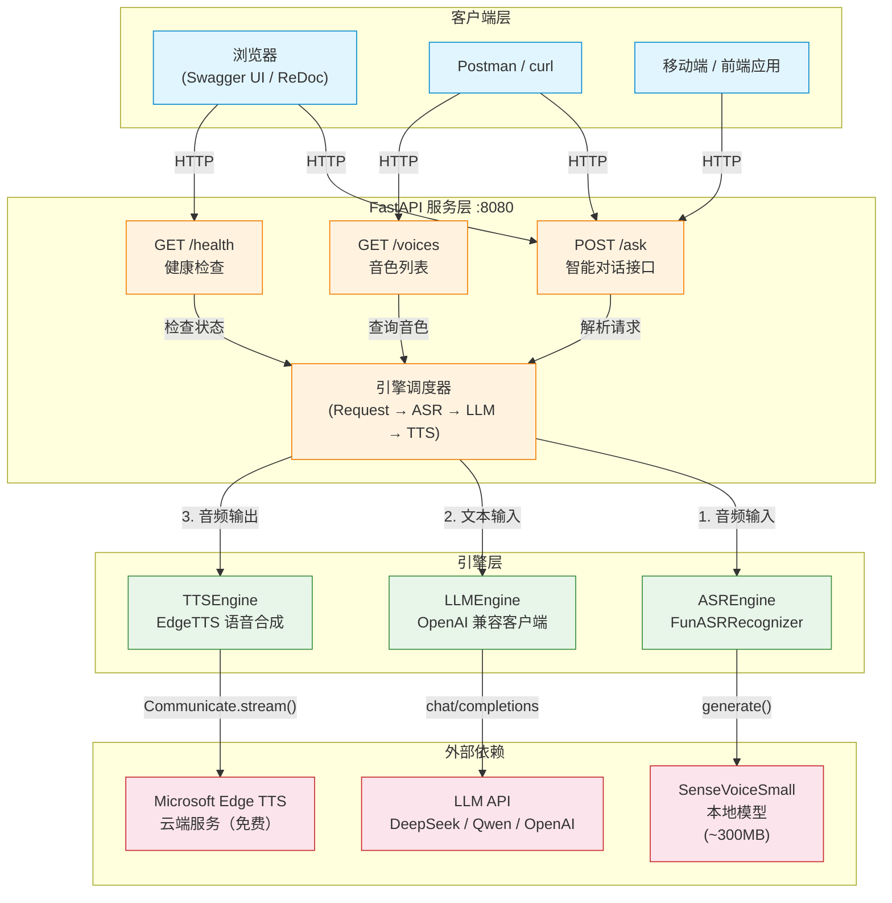

---
AIGC:
    Label: "1"
    ContentProducer: 001191440300708461136T1XGW3
    ProduceID: def75172c756a0fcdccc1bbb3afa79c9_e3be51256af311f1a0095254002afed2
    ReservedCode1: 4kBkU9HZ8Eg0h2PcAJVr0D9hUeRixuZ3XS1xP4ouxBLIRQviXi4NgwFKYf2mMsQqwC2+u/x8w5it55VKdU8cU1WmdnytoNzUh/7u1QOMi3A9vowxBPqefDCkwdPS+lDxDPndoPiJHZRrRKdKVzKUjXbTY4qChN0Y1yOURXlE/I5cyBZM4z80WRnx6OA=
    ContentPropagator: 001191440300708461136T1XGW3
    PropagateID: def75172c756a0fcdccc1bbb3afa79c9_e3be51256af311f1a0095254002afed2
    ReservedCode2: 4kBkU9HZ8Eg0h2PcAJVr0D9hUeRixuZ3XS1xP4ouxBLIRQviXi4NgwFKYf2mMsQqwC2+u/x8w5it55VKdU8cU1WmdnytoNzUh/7u1QOMi3A9vowxBPqefDCkwdPS+lDxDPndoPiJHZRrRKdKVzKUjXbTY4qChN0Y1yOURXlE/I5cyBZM4z80WRnx6OA=
---

# Your Voice Assistant Service — 系统架构

## 架构图



## 数据流说明

### 请求流程总览

```
客户端 → /ask → 引擎调度器 → 外部服务 → 响应
```

### 1. 文本输入 + 文本输出（用户最常用）

```
客户端 POST JSON {"text": "你好"}
  │
  ▼
/ask（跳过 ASR）
  │
  ▼
LLMEngine.ask(question="你好")
  │  ── HTTP POST → DeepSeek / OpenAI API
  │  ←── JSON response
  ▼
AskResponse(success=true, text="你好！我是AI助手...")
  │
  ▼
客户端收到 JSON
```

### 2. 音频输入 + 文本输出

```
客户端 POST binary WAV
  │
  ▼
/ask（input_type=audio）
  │
  ▼
ASREngine.recognize(audio_bytes)
  │  ── FunASR AutoModel.generate()
  │  ←── 识别文本
  ▼
LLMEngine.ask(question=识别文本)
  │  ── HTTP POST → LLM API
  │  ←── JSON response
  ▼
AskResponse(success=true, text=回复文本)
```

### 3. 文本输入 + 音频输出

```
客户端 POST JSON {"text": "你好", "output_type": "audio"}
  │
  ▼
/ask
  │
  ▼
LLMEngine.ask(question="你好")
  │  ←── 回复文本
  ▼
TTSEngine.synthesize(text=回复文本)
  │  ── EdgeTTS Communicate.stream()
  │  ←── MP3 bytes
  ▼
StreamingResponse(mp3_bytes, media_type="audio/mpeg")
```

### 4. 完整链路：音频 → 语音

```
音频输入 → ASR 识别 → LLM 推理 → TTS 合成 → 音频输出

客户端 WAV
  │
  ▼
ASREngine    ── FunASR (本地)        → "今天天气怎么样"
  │
  ▼
LLMEngine    ── DeepSeek API (云端)   → "今天天气晴朗，适合..."
  │
  ▼
TTSEngine    ── Edge TTS (云端免费)   → MP3 音频流
  │
  ▼
客户端收到 MP3
```

## 引擎依赖关系

| 引擎 | 实现类 | 依赖 | 类型 | 输入 | 输出 |
|------|--------|------|------|------|------|
| ASREngine | `FunASRRecognizer` | SenseVoiceSmall 模型 | **本地** | WAV bytes | 文本字符串 |
| LLMEngine | `LLMEngine` | DeepSeek / OpenAI API | **云端** | 文本字符串 | 文本字符串 |
| TTSEngine | `EdgeTTS` | Microsoft Edge TTS | **云端免费** | 文本字符串 | MP3 bytes |

## 扩展性

- **ASR**：可替换为任何实现 `recognize(bytes) → str` 的引擎（如 Whisper、阿里云 ASR）
- **LLM**：任何 OpenAI 兼容 API 均可直接使用（Ollama 本地、通义千问、ChatGLM 等）
- **TTS**：可替换为任何实现 `synthesize(text) → bytes` 的引擎（如 Azure TTS、本地 VITS）
*（内容由AI生成，仅供参考）*
